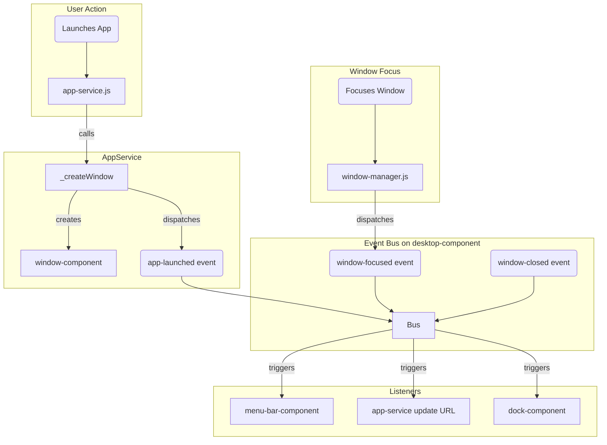

# App Service Refactoring and Decoupling Plan

This document outlines a plan to refactor `src/services/app-service.js` to reduce code duplication and decouple components using an event-driven architecture.

## 1. Problem Analysis

The current implementation of `app-service.js` contains duplicated logic for creating and managing `window-component` instances across multiple methods (`launchApplication`, `handleText`, `displayPlainTextInWindow`). Additionally, there are direct dependencies between services, such as `WindowManager` directly calling methods on `MenuBarComponent`, which makes the system rigid and harder to maintain.

## 2. Proposed Solution

The proposed solution has two main parts:
1.  **Centralize Window Creation:** Introduce a single helper method responsible for creating window components.
2.  **Implement Event-Driven Architecture:** Decouple components by using a system of custom events for communication, with `desktop-component` acting as the central event bus.

### 2.1. Centralize Window Creation

A new private helper method, `_createWindow(options)`, will be added to the `AppService` class.

**Responsibilities:**
- Create a `<window-component>` element.
- Set its attributes (`app-name`, `app-icon`, position, size) based on the `options` object.
- Append any provided content (e.g., a web component or a text div) into the window.
- Append the new window to the desktop's content area.
- Dispatch a new `app-launched` event to notify other components.

### 2.2. Event-Driven Architecture

We will introduce a set of custom events to facilitate communication between components, eliminating direct method calls.

**New Custom Events:**
-   **`app-launched`**: Dispatched by `AppService` after a new application window is created. The event detail will contain the application information.
-   **`window-focused`**: Dispatched by `WindowManager` when a window gains focus. The event detail will contain the window and application name.
-   **`window-closed`**: Dispatched by `window-component` when it is closed. The event detail will contain the window ID and application name.

### 2.3. Component and Service Refactoring

-   **`app-service.js`**:
    -   `launchApplication`, `handleText`, and `displayPlainTextInWindow` will be refactored to use the `_createWindow` helper.
    -   `updateURLWithOpenApps` will be refactored to listen for `app-launched` and `window-closed` events instead of being called directly.
-   **`menu-bar-component.js`**:
    -   Will listen for `app-launched` and `window-focused` events on the `desktop-component`.
    -   Will update its `activeApp` state based on the data from these events.
-   **`window-manager.js`**:
    -   The `handleWindowFocus` method will dispatch the `window-focused` event instead of directly calling `menuBar.setActiveApp()`.
    -   The `handleWindowClose` logic will be simplified and driven by the `window-closed` event.

## 3. Architecture Diagram

The following diagram illustrates the new event-driven flow:

## 4. Benefits

-   **Reduced Code Duplication:** Centralized window creation logic.
-   **Improved Decoupling:** Components are no longer tightly coupled, making them easier to test and maintain.
-   **Enhanced Scalability:** The event-driven architecture makes it easier to add new components that can react to system events without modifying existing services.
-   **Clearer Data Flow:** The flow of information through the system becomes more explicit and easier to trace.