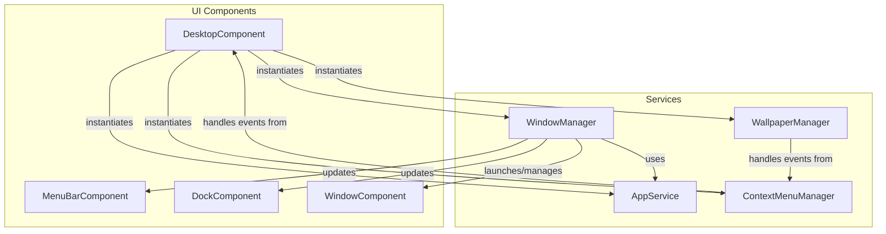

# Desktop Component Refactoring Plan

This document outlines the plan to refactor the `desktop-component.js` for a more modular, scalable, and maintainable architecture.

## 1. Architecture

The current "god component" will be broken down into a main view coordinator (`DesktopComponent`) and several single-responsibility services.

### Architecture Diagram



### Module Responsibilities

*   **`DesktopComponent` (`src/components/desktop-component.js`):** The main view coordinator. Renders the primary layout and delegates all logic to the appropriate services.
*   **`AppService` (`src/services/app-service.js`):** Handles application data, configuration, and dynamic loading.
*   **`WindowManager` (`src/services/window-manager.js`):** Manages the lifecycle of application windows (creation, closing, minimizing, focus).
*   **`ContextMenuManager` (`src/services/context-menu-manager.js`):** Manages the desktop's right-click context menu.
*   **`WallpaperManager` (`src/services/wallpaper-manager.js`):** Manages the desktop background wallpaper.
*   **`config.js` (`src/config.js`):** Provides centralized configuration, such as the list of available applications.

## 2. Directory Structure

To better organize the code, we will adopt a `src`-based directory structure.

```
/ (Project Root)
├── src/
│   ├── components/      # Visual Web Components (replaces 'wc')
│   │   ├── desktop-component.js
│   │   ├── dock-component.js
│   │   ├── menu-bar-component.js
│   │   └── window-component.js
│   │
│   ├── services/        # Non-visual logic and state management
│   │   ├── app-service.js
│   │   ├── context-menu-manager.js
│   │   ├── wallpaper-manager.js
│   │   └── window-manager.js
│   │
│   ├── apps/            # Application-specific code
│   │   ├── finder-webapp.js
│   │   └── ...
│   │
│   └── config.js        # Central configuration
│
├── assets/
│   ├── icons/
│   └── wallpapers/
│
├── index.html
└── style.css
```

## 3. Implementation Steps

1.  **Restructure Directories:** Create the `src` directory and reorganize the existing `wc` and `apps` directories into `src/components` and `src/apps` respectively.
2.  **Create New Files:** Create the empty files for the new services and the configuration file inside the `src` directory.
3.  **Centralize Config:** Move the hardcoded application list from `desktop-component.js` into `src/config.js`.
4.  **Build Services:** Implement each service class (`WallpaperManager`, `ContextMenuManager`, `AppService`, `WindowManager`) by moving the relevant logic out of `desktop-component.js`.
5.  **Refactor `DesktopComponent`:** Update `desktop-component.js` to remove the moved logic, import the new services, instantiate them, and delegate tasks accordingly. Update all file paths for imports.