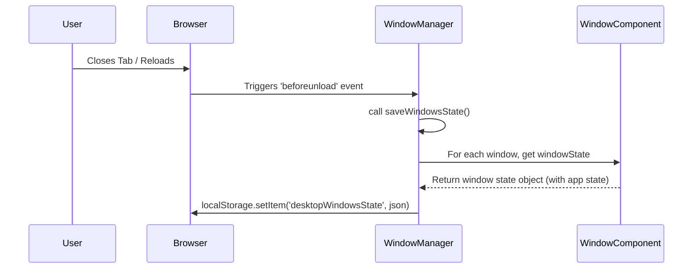

### **Project: Window State Persistence**

**Goal:** To implement a system that saves the state of all open windows (position, size, content URL, etc.) to `localStorage` and restores them on application reload.

**Key Components Involved:**
*   [`src/services/window-manager.js`](src/services/window-manager.js)
*   [`src/services/app-service.js`](src/services/app-service.js)
*   [`src/components/window-component.js`](src/components/window-component.js)
*   Application components (e.g., [`src/apps/safari-chrome-webapp.js`](src/apps/safari-chrome-webapp.js))

---

### **Plan Details**

The implementation will be broken down into three main phases:

1.  **State Serialization:** Gathering and saving the state of open windows.
2.  **State Deserialization:** Restoring windows from the saved state on startup.
3.  **Application-Level State:** Ensuring individual applications can save and restore their own internal state.

---

#### **Phase 1: State Serialization**

**Objective:** To collect the state of all open windows and save it to `localStorage`.

*   **[`window-manager.js`](src/services/window-manager.js)**
    1.  **Create `saveWindowsState()` function:**
        *   This function will select all `<window-component>` elements in the DOM.
        *   It will iterate through them, calling the existing `windowState` getter on each to get its complete state.
        *   The collected states will be serialized into a JSON string.
        *   This JSON string will be saved to `localStorage` under a key like `desktopWindowsState`.
    2.  **Trigger Saving:**
        *   Add an event listener for the `beforeunload` event on the `window` object to call `saveWindowsState()` automatically when the user is about to leave the page.

*   **[`window-component.js`](src/components/window-component.js)**
    1.  **Enhance `windowState` getter:**
        *   This getter will be updated to also get the state from the application running inside it by calling a new `getAppState()` method on the child component (see Phase 3).



---

#### **Phase 2: State Deserialization**

**Objective:** To read the saved state from `localStorage` on application startup and recreate the windows.

*   **[`window-manager.js`](src/services/window-manager.js)**
    1.  **Create `restoreWindowsState()` function:**
        *   This function will be called once when the application loads.
        *   It will read the JSON string from `localStorage`.
        *   If state exists, it will parse it into an array of window state objects.
        *   It will loop through each state object and use the `app-service` to launch a new application/window for each one, passing the specific state object for configuration.

*   **[`app-service.js`](src/services/app-service.js)**
    1.  **Create `launchApp(appName, initialState)` function:**
        *   This new function will act as a factory for creating applications.
        *   Based on the `appName`, it will create the correct web component (e.g., `<safari-chrome-webapp>`).
        *   It will then call the existing `_createWindow` method, passing the created component and the `initialState` object.
    2.  **Modify `_createWindow(options)`:**
        *   Update this function to accept an `initialState` object.
        *   When `initialState` is provided, it will use the position, size, and other properties from the state object instead of the defaults.
        *   It will pass the application-specific part of the state (`appState`) to the content component by setting an `initial-state` attribute on it.

```mermaid
graph TD
    A[Application Start] --> B[Instantiate WindowManager];
    B --> C{Call restoreWindowsState()};
    C --> D{Read from localStorage};
    D -- State Found --> E{Parse JSON};
    E --> F{For each saved window state};
    F --> G[Call AppService.launchApp(appName, state)];
    G --> H[AppService creates app component];
    H --> I[AppService calls _createWindow with state];
    I --> J[Window is created at correct position/size];
    J --> K[App component restores its internal state];
    F -- Loop Finished --> L[All Windows Restored];
    D -- No State --> M[Load Default Desktop];
```

---

#### **Phase 3: Application-Level State**

**Objective:** To enable each application to manage its own unique state.

*   **Application Components (e.g., [`src/apps/safari-chrome-webapp.js`](src/apps/safari-chrome-webapp.js))**
    1.  **Implement `getAppState()` method:**
        *   This method will return an object containing only the data that the specific application needs to restore itself.
        *   For `safari-chrome-webapp`, this would be `{ "currentUrl": this.currentUrl }`.
        *   The `window-component` will call this method when gathering its state.
    2.  **Implement State Restoration Logic:**
        *   In `connectedCallback`, the component will check for an `initial-state` attribute.
        *   If the attribute exists, it will parse the JSON and use the data to set its initial state (e.g., for Safari, it would call `this.loadUrl()` with the restored URL).
        *   If the attribute does not exist, it will perform its normal first-time setup (e.g., show the welcome screen).